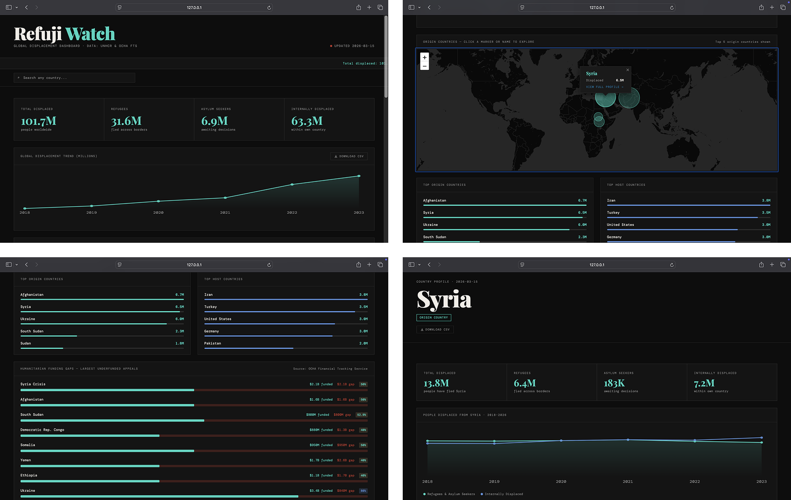

# Refuji Watch

A real-time global displacement dashboard powered by live UNHCR & OCHA data.



---

## What is Refuji Watch?

Refuji Watch is an open-source humanitarian data dashboard that makes global displacement data accessible to everyone — journalists, NGOs, researchers, students, and the public.

It pulls live data from the UN Refugee Agency (UNHCR) and the OCHA Financial Tracking Service, transforming dense spreadsheets and reports into clean, interactive visualisations.

---

## Features

- 🌍 **Live global stats** — total displaced, refugees, asylum seekers, and IDPs updated daily
- 🗺️ **Interactive world map** — origin countries with proportional markers
- 📈 **Trend charts** — displacement trends from 2018 to present with hover tooltips
- 💰 **Funding gap tracker** — humanitarian appeals vs actual funding received
- 🔍 **Country search** — explore all 200+ countries in the dataset
- 📄 **Country drill-down pages** — individual profiles showing origin and host data
- 📊 **CSV download** — export global or per-country data for research and reporting
- 📱 **Responsive design** — works on desktop and mobile

---

## Data Sources

| Source | Data |
|--------|------|
| [UNHCR Refugee Data Finder](https://www.unhcr.org/refugee-statistics) | Displacement totals, trends, country data |
| [OCHA Financial Tracking Service](https://fts.unocha.org) | Humanitarian funding appeals and gaps |

All data is fetched via free, open APIs — no API keys required.

---

## Tech Stack

| Layer | Technology |
|-------|-----------|
| Frontend | HTML, CSS, JavaScript |
| Data pipeline | Python 3 |
| Maps | Leaflet.js |
| Hosting | AWS S3 + CloudFront |
| Scheduler | AWS Lambda + EventBridge |

---

## Project Structure

```
refuji-watch/
├── frontend/
│   ├── index.html        # Main dashboard
│   ├── country.html      # Country drill-down page
│   └── style.css         # Styles (currently embedded)
├── pipeline/
│   └── fetch_data.py     # UNHCR & OCHA data fetcher
└── data/
    └── sample.json       # Latest fetched data
```

---

## Running Locally

### Prerequisites
- Python 3
- VS Code with Live Server extension

### Setup

**1. Clone the repo**
```bash
git clone https://github.com/shynsec/refuji-watch.git
cd refuji-watch
```

**2. Install Python dependencies**
```bash
pip3 install requests
```

**3. Fetch live data**
```bash
cd pipeline
python3 fetch_data.py
```

**4. Open the dashboard**

In VS Code, right-click the `frontend/` folder and select **Open with Live Server**.

Visit `http://127.0.0.1:5500/frontend/index.html`

---

## Deployment

Refuji Watch is deployed on AWS using S3 for static hosting and CloudFront for global CDN delivery. The data pipeline runs automatically via AWS Lambda on a daily schedule.

---

## Why I Built This

The data exists. UNHCR publishes comprehensive displacement statistics. OCHA tracks every humanitarian dollar. But the tools to explore that data are clunky, slow, and built for specialists.

Refuji Watch is built for everyone — a clean, fast, public interface to one of the most important datasets in the world.

---

## Contributing

Contributions are welcome. If you spot a data issue, have a feature idea, or want to improve the pipeline, open an issue or submit a pull request.

---

## License

MIT — free to use, share, and adapt with attribution.

---

<p align="center">
  Built by <a href="https://github.com/shynsec">shynsec</a> · Data: UNHCR & OCHA · Open Source
</p>
